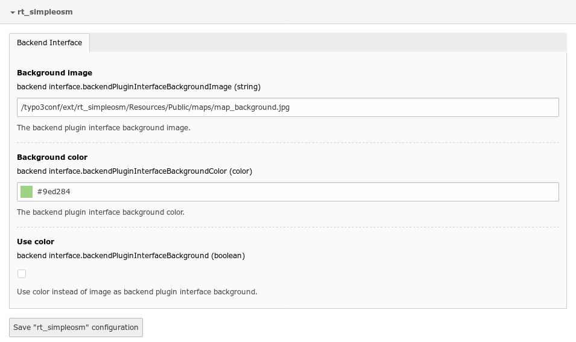

.. ==================================================
.. FOR YOUR INFORMATION
.. --------------------------------------------------
.. -*- coding: utf-8 -*- with BOM.

.. include:: ../Includes.txt

.. _admin-manual:

Administrator Manual
====================

Target group: **Administrators**

You can adust backend plugin interface appearance by configuring the global extension.

    - In TYPO3 V7 or V8 : Admin Tools > Extensions Manager > Simple OpenStreetMap (rt_simpleosm) > Cog configuration icon.
    - In TYPO3 V9 : Admin Tools > Settings module > Configure extension > rt_simpleosm.

Here, you can configure :

    - The backend plugin interface background image,
    - The backend plugin interface background color,
    - Choosing between image or color for the backend plugin interface.
    - Choosing to download Leaflet library and plugins (JavaScript and CSS) from popular Content Delivery Network (Faster).

   OSM plugin configuration.