.. ==================================================
.. FOR YOUR INFORMATION
.. --------------------------------------------------
.. -*- coding: utf-8 -*- with BOM.

.. include:: ../Includes.txt

.. _user-manual:

Users Manual
============

Target group: **Editors**

To display an OpenStreetMap on your page, you have to follow 2 steps:

- **Create a database OSM record for the map with List module**:

you will have to enter for one map

    - The title,
    - The address,
    - The latitude,
    - The longitude,
    - A custom marker.

.. tip::

To find the longitude and the latitude from an adress you can use this site :

`latlong.net <https://www.latlong.net/>`_

You don't really need to create a Folder page for this. You can store this record in any standard page.

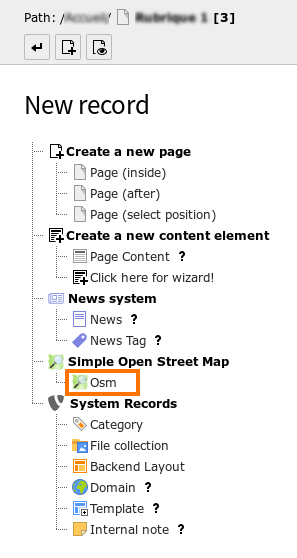

   Inserting a new OSM record.

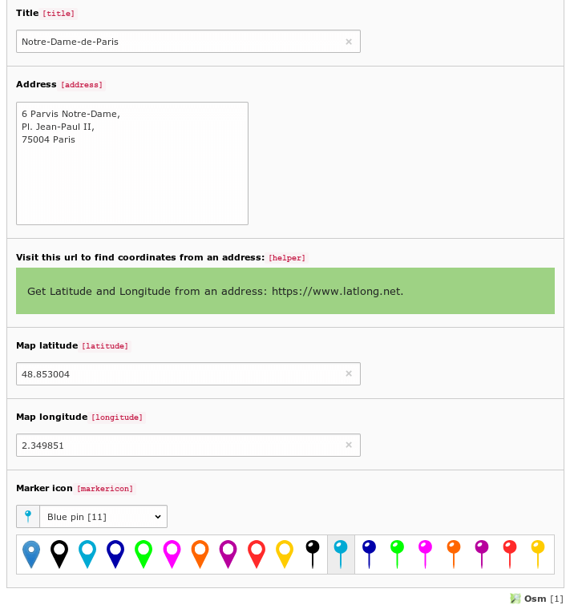

   Configuring an OSM record.

- **Insert the simple OpenStreetMap plugin with Page module**:

you will have to configure the desired map by specifing:

    - A header for the plugin,
    - The OSM record or tt_address record for the desired map,
    - The map style, width, height and border radius,
    - The map zoom factor,
    - The map popup options,
    - The map zoom, mouse and fullscreen options,
    - The navigational mini map display,
    - The external caption menu display.

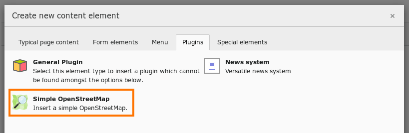

   Inserting an OSM plugin.

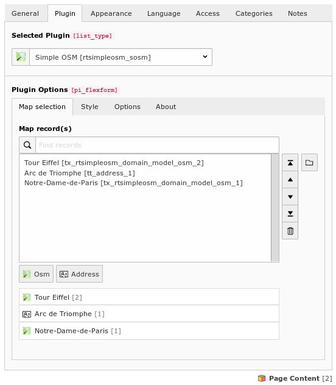

   OSM plugin: selecting an Osm record or a tt_address record.

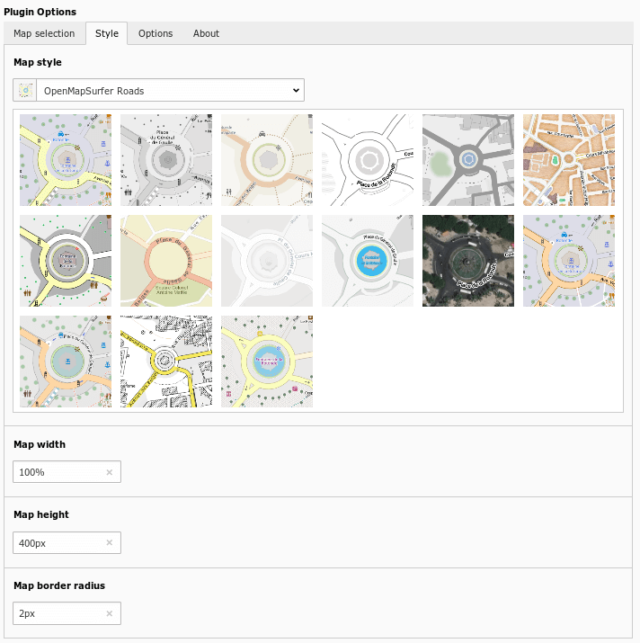

   OSM plugin: selecting a map style, width, height and border radius.

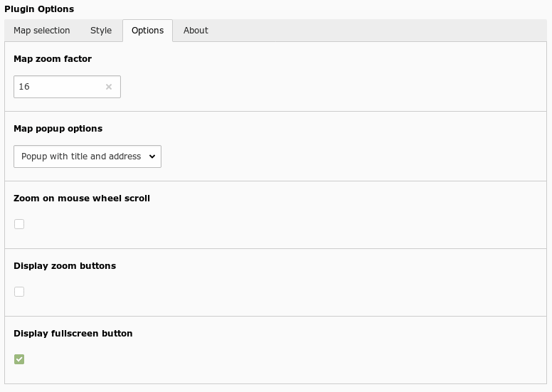

   OSM plugin: Configuring map options.

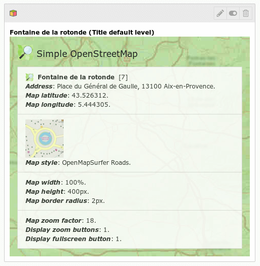

   OSM plugin: Appearance in Page module.

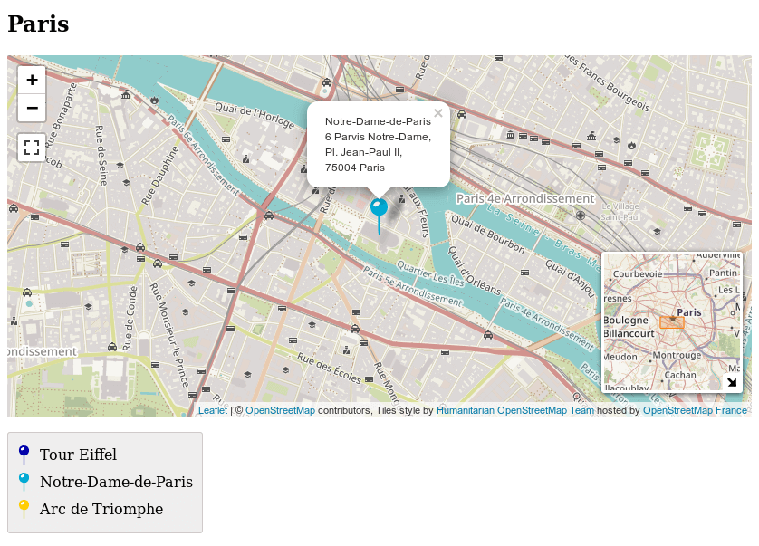

   OSM plugin: Rendering with navigational mini map and external caption menu.

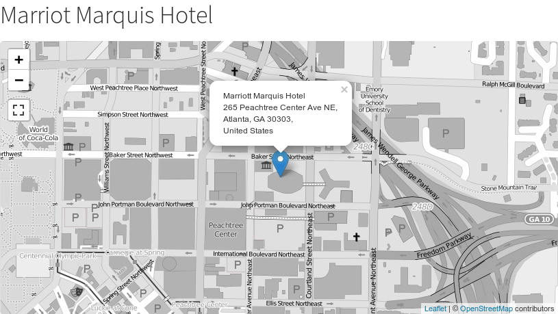

   OSM plugin: Frontend rendering with black and white provider.

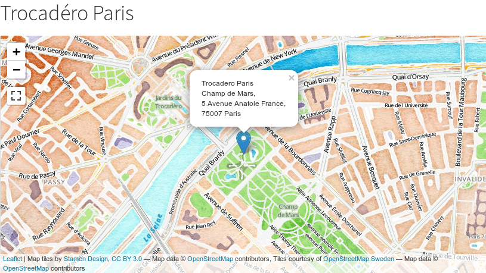

   OSM plugin: Frontend rendering with Stamen Design watercolor provider.

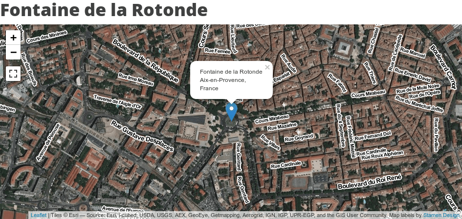

   OSM plugin: Frontend rendering with ESRI Imagery + Stamen labels provider.

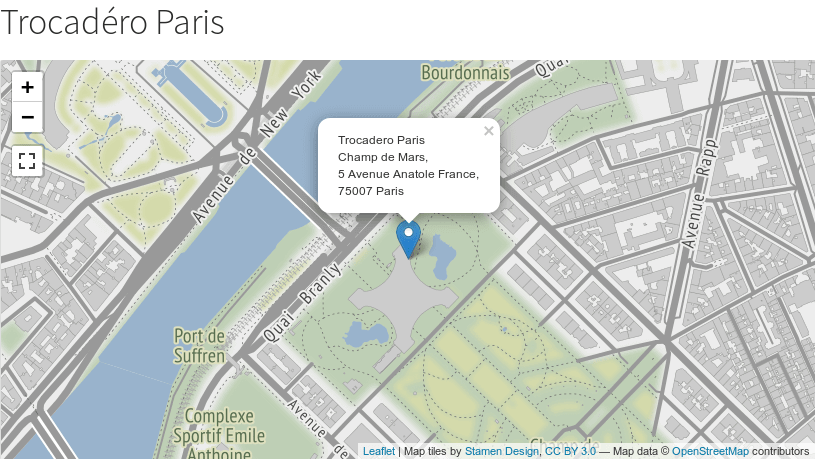

   OSM plugin: Frontend rendering with Stamen Design terrain provider.

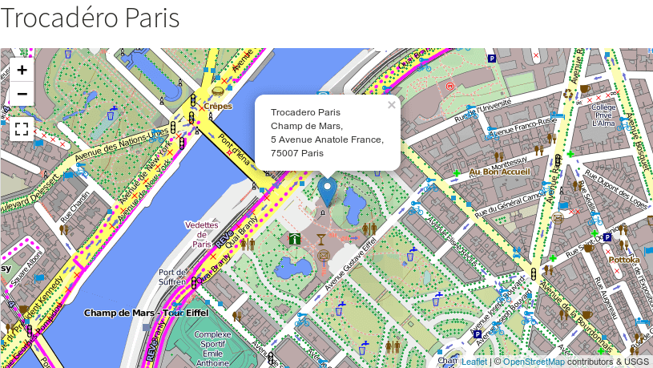

   OSM plugin: Frontend rendering with MTB map (Europe only) provider.